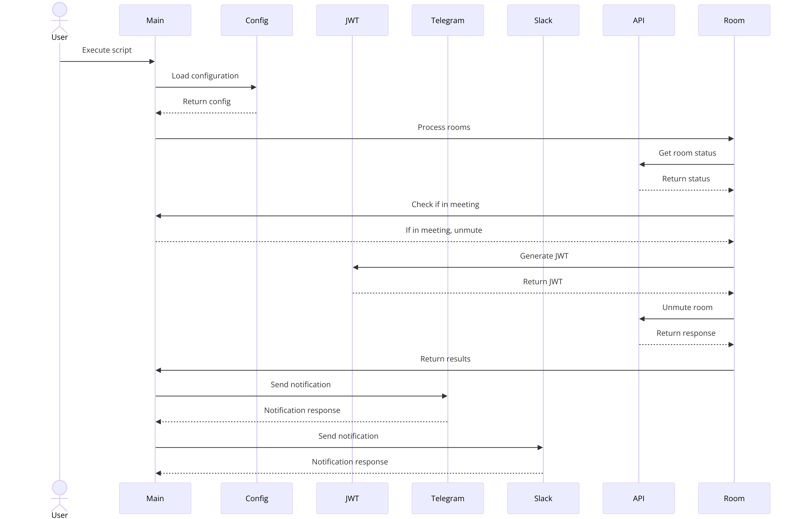
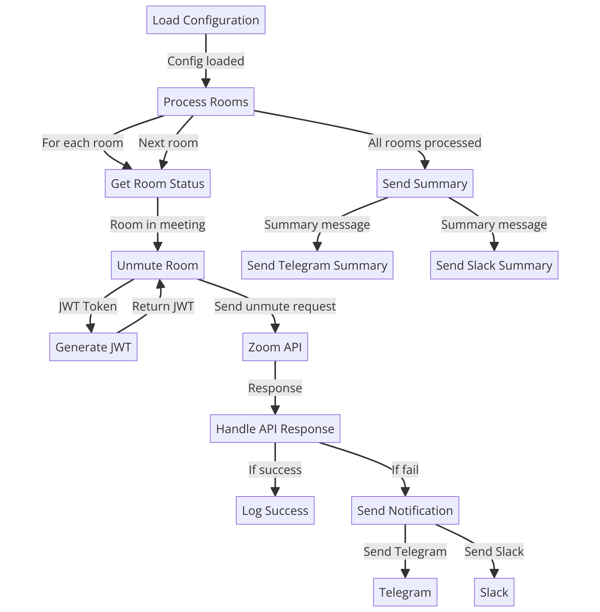

# Zoom Room Manager

Automated Zoom Room management script with robust error handling, notifications via Telegram and Slack, and optimized performance using concurrency and session management.

## Features
- Retrieve the current status of Zoom Rooms
- Automatically unmute audio and video if the room is in a meeting
- Comprehensive error handling and retries with exponential backoff
- Detailed logging for troubleshooting
- Notifications via Telegram and Slack

------

## Getting API Keys & Setup

### Zoom API Keys
1. Go to the [Zoom App Marketplace](https://marketplace.zoom.us/).
2. Sign in and create a new app using the JWT option.
3. After creating the app, you will find your API Key and API Secret on the app’s credentials page.

### Telegram Bot Token
1. Open Telegram and search for the "BotFather".
2. Start a chat with BotFather and send the command `/newbot`.
3. Follow the instructions to create a new bot and get the bot token.

### Slack Webhook URL
1. Go to your Slack workspace and navigate to `Apps`.
2. Search for "Incoming Webhooks" and add it to your workspace.
3. Configure the webhook and copy the webhook URL provided.

------

## Requirements
- Python 3.6+
- Install dependencies:
  ```sh
  pip3 install -r requirements.txt
  ```

## Configuration
Create a `config.json` file in the root directory with the following structure:
```json
{
  "rooms": [
    {
      "room_id": "your_room_id_1",
      "api_key": "your_api_key1",
      "api_secret": "your_api_secret1"
    },
    {
      "room_id": "your_room_id_2",
      "api_key": "your_api_key2",
      "api_secret": "your_api_secret2"
    }
  ],
  "telegram": {
    "bot_token": "your_telegram_bot_token",
    "chat_id": "your_telegram_chat_id"
  },
  "slack": {
    "webhook_url": "your_slack_webhook_url"
  }
}
```

## Usage
Run the script:
```sh
python3 manage_zoom_rooms.py
```

## Docker Setup
### Dockerfile
Create a `Dockerfile` in the root directory:
```dockerfile
# Use the official Python image
FROM python:3.8-slim

# Set the working directory
WORKDIR /app

# Copy the requirements file
COPY requirements.txt .

# Install the dependencies
RUN pip install --no-cache-dir -r requirements.txt

# Copy the rest of the application
COPY . .

# Run the application
CMD ["python3", "manage_zoom_rooms.py"]
```

### Build and Run Docker Container
1. Build the Docker image:
    ```sh
    docker build -t zoom-room-manager .
    ```

2. Run the Docker container:
    ```sh
    docker run -d --name zoom-room-manager -v $(pwd)/config.json:/app/config.json zoom-room-manager
    ```

### docker-compose.yml
Create a `docker-compose.yml` file in the root directory:
```yaml
services:
  zoom-room-manager:
    build: .
    container_name: zoom-room-manager
    volumes:
      - ./config.json:/app/config.json  # Mount the config file to the container
    logging:
      driver: "json-file"
      options:
        max-size: "10m"
        max-file: "3"
```

### Build and Run Docker Container
1. **Build the Docker image**:
    ```sh
    docker build -t zoom-room-manager .
    ```

2. **Run the Docker container using Docker Compose**:
    ```sh
    docker-compose up -d
    ```

## Technical Details

### For Developers

#### Code Structure
- `manage_zoom_rooms.py`: Main script file.
- `config.json`: Configuration file for room and notification details.
- `requirements.txt`: List of Python dependencies.

#### Key Functions
- `generate_jwt(api_key, api_secret)`: Generates JWT token for authentication.
- `send_telegram_message(message)`: Sends a message to a specified Telegram chat.
- `send_slack_message(message)`: Sends a message to a specified Slack webhook.
- `send_notification(message)`: Sends notifications to both Telegram and Slack.
- `handle_api_response(response, action, room_id)`: Handles API responses and errors.
- `unmute_zoom_room(session, room_id, api_key, api_secret)`: Unmutes audio and video in a Zoom room.
- `get_room_status(session, room_id, api_key, api_secret)`: Retrieves the status of a Zoom room.
- `process_room(session, room)`: Processes each room by checking status and unmuting if necessary.

#### Concurrency
- Utilizes `ThreadPoolExecutor` for concurrent processing of multiple rooms.
- Manages retries and exponential backoff using `requests.Session` with `HTTPAdapter`.

### Notes for Developers
- Ensure the `config.json` file is correctly configured and placed in the root directory before building the Docker image.
- The `volumes` directive in `docker-compose.yml` mounts the `config.json` file into the container, allowing the script to access it.
- The logging configuration in `docker-compose.yml` ensures that logs are rotated, preventing excessive log file growth.
- The application runs using the command specified in the `CMD` instruction of the `Dockerfile`.

------

### For Operators

#### Monitoring and Logs
- Logs are maintained in `zoom_rooms.log` for detailed troubleshooting.
- Notifications are sent via Telegram and Slack for important events and errors.

#### Configuration Management
- `config.json` should be securely managed with appropriate API keys and secrets.
- Ensure the configuration file is accurate to avoid runtime errors.

#### Error Handling
- The script includes robust error handling and retry mechanisms.
- Detailed logs and notifications will help in identifying and resolving issues promptly.

## Sequence Diagram


## Flow Diagram



## License
MIT License
